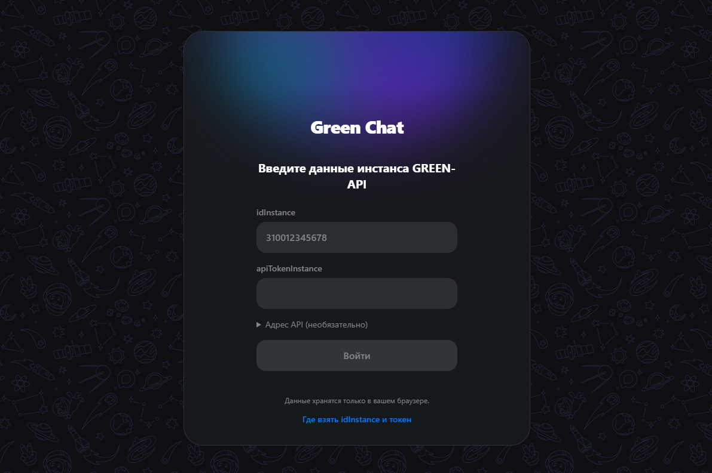
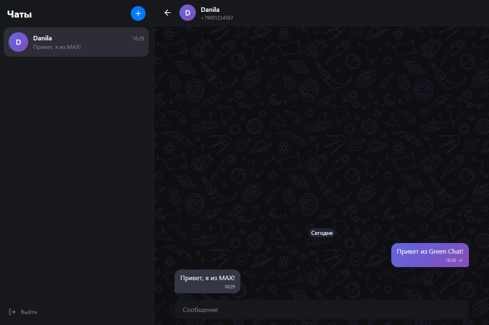

# Green Chat

A minimal chat client for **MAX** built on top of [GREEN-API](https://green-api.com/max).
Sign in with your instance credentials, start a chat by phone number, send text messages
and see replies in real time. The UI follows the look of the [web.max.ru](https://web.max.ru/) chat.

- **Live demo:** https://green-chat-max.vercel.app

## Screenshots

<div align="center">
  
  
</div>

## Features

- Sign in with `idInstance` and `apiTokenInstance` (checked via `getStateInstance`)
- Create a chat by phone number (`checkAccount` returns the MAX `chatId`)
- Send text messages (`sendMessage`) with optimistic UI, retry on failure and delivery
  statuses: sent, delivered, read, failed (with the reason from MAX)
- Receive text messages through the HTTP API (`receiveNotification` / `deleteNotification`, long polling)
- Chats and history are kept in `localStorage`; signing out clears them
- Responsive layout (chat list and conversation switch on narrow screens)

Scope is intentionally small: **text messages in personal chats only**.

## Tech stack

react 19 · typescript · vite · tailwind css · zustand ·
zod · lucide-react

## Getting started

### 1. Prepare a GREEN-API instance

1. Sign up at [console.green-api.com](https://console.green-api.com) and create a **MAX** instance
   (the free Developer plan is enough).
2. Authorize the instance by scanning the QR code with the MAX app.
   Using a secondary MAX account for testing is recommended.
3. In the instance settings make sure notifications about **incoming messages** are enabled and the
   **webhook URL is empty**: the app reads messages through the HTTP API, which does not work
   when a webhook URL is set.
4. Copy `idInstance` and `apiTokenInstance` from the console.

### 2. Run locally

Requirements: Node.js 22+ and pnpm (`corepack enable pnpm` if you don't have it).

```bash
git clone https://github.com/flionx/green-api-chat.git
cd green-api-chat
pnpm install
pnpm dev
```

Open the URL printed by Vite (usually <http://localhost:5173>).

### 3. Try it

1. Enter `idInstance` and `apiTokenInstance` and press **Sign in**.
2. Press **+**, enter the recipient's phone number in international format
   (for example `+7 900 123-45-67`) and create the chat.
3. Type a message and press **Enter** (**Shift+Enter** inserts a new line).
4. Reply from the recipient's MAX account: the answer appears in the chat within a few seconds.

### Scripts

| Command        | Description                         |
| -------------- | ----------------------------------- |
| `pnpm dev`     | Start the dev server                |
| `pnpm build`   | Type-check and build for production |
| `pnpm preview` | Preview the production build        |
| `pnpm lint`    | Lint with eslint                    |
| `pnpm format`  | Format with prettier                |

## How it works

```
Sending:    UI ── POST sendMessage ──────────► GREEN-API ──► MAX ──► recipient
Receiving:  recipient ──► MAX ──► GREEN-API (queue)
            UI ◄── GET receiveNotification (long polling, 20 s)
            UI ── DELETE deleteNotification (acknowledge)
```

- **Chat IDs.** MAX uses numeric chat IDs, so a phone number is first resolved with `checkAccount`.
  Already known numbers are not re-checked to save the plan's limits.
- **Delivery statuses.** `sendMessage` only confirms that a message was queued. The final result
  arrives later as an `outgoingMessageStatus` notification and updates the message in the UI.
- **Robust polling.** The polling loop stops on sign-out (`AbortController`), backs off on network
  errors and shows a banner. Unknown or non-text notifications are skipped but always deleted,
  so they never block the queue. Messages are de-duplicated by `idMessage`.
- **API host.** The host is derived from the first four digits of `idInstance`
  (for example `3100…` → `https://3100.api.green-api.com`). It can be overridden in the
  optional **API address** field on the sign-in form.

## Project structure

```
src/
├─ app/        entry point, global styles
├─ pages/      login, chat
├─ features/   auth, new-chat, send-message, receive-messages
├─ entities/   session, chat (store, message bubble, list item)
└─ shared/     api (GREEN-API client, Zod schemas), lib, ui, assets
```

Imports go only downwards: `app → pages → features → entities → shared`.

## Notes and limitations

- Only text messages in personal chats. Replies are shown as plain text; reactions, files and
  groups are ignored.
- Free-plan limits (number of chats and account checks) are enforced by GREEN-API; the app shows an error.
- During testing, messages to a MAX account that did not know the sender failed with a
  `failed` status until the accounts were added to each other's contacts. The app displays the
  reason and offers a retry.
- Credentials are stored in `localStorage` so a page reload does not sign you out. They are sent
  only to GREEN-API and removed on sign-out. Never commit your token.
- There is no backend: the browser talks to GREEN-API directly.

## License

Released under the [MIT License](./LICENSE).
